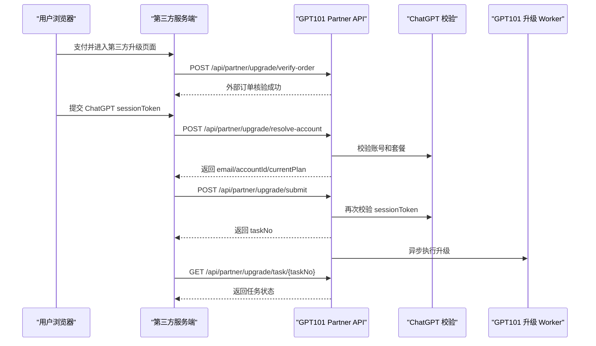

# GPT101 第三方升级 API

版本日期：2026-05-23

本文档面向第三方服务端接入方。第三方负责自己的支付、订单、页面和用户交互；GPT101 提供服务端 API，用于把第三方已支付订单接入现有升级链路。

第三方前端页面不应直接调用 GPT101 Partner API。所有请求都应由第三方服务端代理完成，避免 `appSecret`、签名逻辑和用户 `sessionToken` 暴露到浏览器、URL、日志、埋点或第三方监控中。

## 1. 接入流程



推荐顺序：

1. 用户在第三方完成支付。
2. 第三方用自己的唯一订单号调用订单核验接口。
3. 第三方页面收集用户 ChatGPT `sessionToken`。
4. 第三方服务端调用 session token 核验接口，展示账号信息给用户确认。
5. 第三方服务端调用提交升级接口，拿到 `taskNo`。
6. 第三方用 `taskNo` 查询任务状态，并在自己的页面展示结果。

## 2. 接入方身份

GPT101 会为每个第三方分配独立的：

| 字段        | 说明                                                                   |
| ----------- | ---------------------------------------------------------------------- |
| `appKey`    | 接入方公开身份标识。每次请求都必须携带。                               |
| `appSecret` | 服务端签名密钥。只能保存在第三方服务端，不能下发到前端或写入普通日志。 |

GPT101 侧会为接入方配置：

| 配置项               | 说明                                                               |
| -------------------- | ------------------------------------------------------------------ |
| `status`             | 只有 `active` 状态可以调用接口。                                   |
| `allowedProducts`    | 允许售卖的产品和会员档位。必须显式配置，未配置时订单核验会被拒绝。 |
| `ipAllowlist`        | 可选 IP 白名单。配置后，仅允许白名单 IP 调用。                     |
| `rateLimitPerMinute` | 每分钟成功鉴权请求数限制，默认 120。                               |

`productCode` 和 `memberType` 必须同时满足：

1. 属于 GPT101 当前支持的内部产品/档位。
2. 已在该接入方的 `allowedProducts` 中授权。

当前常见取值：

| productCode | memberType                 |
| ----------- | -------------------------- |
| `gpt`       | `plus`, `pro100`, `pro200` |
| `claude`    | `pro`                      |
| `gemini`    | `advanced`                 |
| `grok`      | `premium`, `supergrok`     |

实际可用范围以 GPT101 给该接入方配置的授权为准。

## 3. 基础协议

### 3.1 Base URL

生产环境：

```text
https://gpt101.org
```

接口路径均为同站点绝对路径，例如：

```text
https://gpt101.org/api/partner/upgrade/verify-order
```

生产环境只允许 HTTPS。

### 3.2 统一响应

Partner API 沿用 GPT101 当前统一响应包络：

```ts
type ApiResponse<T> =
  | {
      code: 0;
      message: 'ok';
      data: T;
    }
  | {
      code: -1;
      message: string;
    };
```

说明：

- `code=0` 表示业务成功。
- `code=-1` 表示参数错误、鉴权失败、业务不可继续或服务端异常。
- 当前实现没有稳定的 `errorCode` 字段，接入方应以 `code` 判断成功失败，以 `message` 做展示或日志排查。
- 当前实现通常使用 HTTP 200 返回业务错误，不要只依赖 HTTP status 判断业务成功。

### 3.3 请求体格式

POST 接口统一使用 JSON：

```http
Content-Type: application/json
```

签名必须覆盖原始请求体字符串。第三方服务端计算签名后，发送给 GPT101 的 body 必须与签名时使用的 `rawBody` 完全一致。

GET 接口没有请求体，签名时 `rawBody` 使用空字符串。

## 4. 签名协议

所有 Partner API 请求都必须携带以下请求头：

```http
X-GPT101-App-Key: <appKey>
X-GPT101-Timestamp: <unix seconds>
X-GPT101-Nonce: <unique nonce>
X-GPT101-Signature: <hex hmac sha256>
```

字段说明：

| Header               | 必填 | 说明                                             |
| -------------------- | ---- | ------------------------------------------------ |
| `X-GPT101-App-Key`   | 是   | GPT101 分配给接入方的 `appKey`。                 |
| `X-GPT101-Timestamp` | 是   | Unix 秒级时间戳。有效窗口为 5 分钟。             |
| `X-GPT101-Nonce`     | 是   | 请求唯一随机串。同一 `appKey + nonce` 不可复用。 |
| `X-GPT101-Signature` | 是   | HMAC-SHA256 hex 签名。                           |

签名原文：

```text
bodyHash = sha256(rawBody)

canonical = [
  HTTP_METHOD_UPPERCASE,
  REQUEST_PATH,
  X-GPT101-Timestamp,
  X-GPT101-Nonce,
  bodyHash
].join("\n")

signature = hmac_sha256_hex(appSecret, canonical)
```

`REQUEST_PATH` 是 URL pathname，不包含协议、域名和 query string。例如：

```text
/api/partner/upgrade/task/TS-20260523-1234
```

校验规则：

- `timestamp` 有效窗口为 5 分钟。
- `nonce` 服务端保留 10 分钟；重复 nonce 会返回 `重复请求`。
- 签名使用原始请求体，不使用重新序列化后的 JSON。
- `appSecret` 轮换后，旧密钥签名立即失效。
- 失败鉴权审计会按 `appKey + client IP + path` 做窗口封顶，避免错误签名请求放大成无限 DB 写入。

### 4.1 Node.js 签名示例

```ts
import crypto from 'node:crypto';

function sha256Hex(input: string) {
  return crypto.createHash('sha256').update(input).digest('hex');
}

function signPartnerRequest(args: {
  appSecret: string;
  method: string;
  path: string;
  rawBody: string;
  timestamp: number;
  nonce: string;
}) {
  const bodyHash = sha256Hex(args.rawBody);
  const canonical = [
    args.method.toUpperCase(),
    args.path,
    String(args.timestamp),
    args.nonce,
    bodyHash,
  ].join('\n');

  return crypto
    .createHmac('sha256', args.appSecret)
    .update(canonical)
    .digest('hex');
}
```

POST 示例：

```ts
const appKey = process.env.GPT101_APP_KEY!;
const appSecret = process.env.GPT101_APP_SECRET!;
const method = 'POST';
const path = '/api/partner/upgrade/verify-order';
const rawBody = JSON.stringify({
  externalOrderNo: 'ORDER-20260523-0001',
  productCode: 'gpt',
  memberType: 'plus',
});
const timestamp = Math.floor(Date.now() / 1000);
const nonce = crypto.randomUUID();
const signature = signPartnerRequest({
  appSecret,
  method,
  path,
  rawBody,
  timestamp,
  nonce,
});

const response = await fetch(`https://gpt101.org${path}`, {
  method,
  headers: {
    'content-type': 'application/json',
    'x-gpt101-app-key': appKey,
    'x-gpt101-timestamp': String(timestamp),
    'x-gpt101-nonce': nonce,
    'x-gpt101-signature': signature,
  },
  body: rawBody,
});
```

GET 示例：

```ts
const method = 'GET';
const path = '/api/partner/upgrade/task/TS-20260523-1234';
const rawBody = '';
```

## 5. API 列表

### 5.1 外部订单核验

```http
POST /api/partner/upgrade/verify-order
Content-Type: application/json
```

用途：

- 校验第三方订单是否可进入 GPT101 升级链路。
- 使用 `appKey + externalOrderNo` 建立幂等映射。
- GPT101 内部会生成升级凭证，但不会把内部凭证明文返回给第三方。

请求体：

```json
{
  "externalOrderNo": "ORDER-20260523-0001",
  "productCode": "gpt",
  "memberType": "plus"
}
```

字段：

| 字段              | 类型   | 必填 | 说明                                       |
| ----------------- | ------ | ---- | ------------------------------------------ |
| `externalOrderNo` | string | 是   | 第三方订单号、流水号或其他全局唯一业务号。 |
| `productCode`     | string | 是   | 产品代码。必须在接入方授权范围内。         |
| `memberType`      | string | 是   | 会员档位。必须在接入方授权范围内。         |

成功响应：

```json
{
  "code": 0,
  "message": "ok",
  "data": {
    "valid": true,
    "externalOrderNo": "ORDER-20260523-0001",
    "productCode": "gpt",
    "memberType": "plus"
  }
}
```

幂等规则：

- 同一 `appKey + externalOrderNo` 重复调用，会返回同一订单映射结果。
- 同一 `appKey + externalOrderNo` 如果第二次传入不同 `productCode` 或 `memberType`，会返回错误 `外部订单商品不一致`。
- 不同接入方可以使用相同 `externalOrderNo`，互不冲突。

常见错误：

| message                | 含义                                   |
| ---------------------- | -------------------------------------- |
| `缺少外部订单号`       | `externalOrderNo` 缺失或为空。         |
| `缺少产品类型`         | `productCode` 缺失或为空。             |
| `缺少会员类型`         | `memberType` 缺失或为空。              |
| `商品或会员类型无效`   | 产品或档位不是 GPT101 支持的内部取值。 |
| `接入方未配置可用商品` | 该 `appKey` 没有配置可售卖商品。       |
| `接入方不支持该商品`   | 该产品或档位未授权给当前接入方。       |
| `外部订单商品不一致`   | 同一订单号重复核验时产品或档位不一致。 |

### 5.2 Session Token 核验

```http
POST /api/partner/upgrade/resolve-account
Content-Type: application/json
```

用途：

- 校验用户提供的 ChatGPT `sessionToken` 是否可用。
- 返回升级目标账号的邮箱、账号 ID 和当前套餐。
- 第三方用返回结果让用户确认账号。

调用前置条件：

- 必须先成功调用外部订单核验接口。
- `externalOrderNo` 必须属于当前 `appKey`。

请求体：

```json
{
  "externalOrderNo": "ORDER-20260523-0001",
  "sessionToken": "{\"user\":{\"id\":\"...\",\"email\":\"user@example.com\"},\"account\":{\"id\":\"...\",\"planType\":\"free\"},\"accessToken\":\"...\"}"
}
```

字段：

| 字段              | 类型   | 必填 | 说明                                                                        |
| ----------------- | ------ | ---- | --------------------------------------------------------------------------- |
| `externalOrderNo` | string | 是   | 已核验过的第三方订单号。                                                    |
| `sessionToken`    | string | 是   | 用户提供的 ChatGPT Session Token 内容。支持完整 Session JSON 或可解析 JWT。 |

成功响应：

```json
{
  "code": 0,
  "message": "ok",
  "data": {
    "email": "user@example.com",
    "accountId": "account-id",
    "currentPlan": "free"
  }
}
```

响应字段：

| 字段          | 类型   | 说明                               |
| ------------- | ------ | ---------------------------------- |
| `email`       | string | 服务端校验得到的 ChatGPT 邮箱。    |
| `accountId`   | string | 服务端校验得到的 ChatGPT 账号 ID。 |
| `currentPlan` | string | 当前套餐，例如 `free`。            |

安全说明：

- Partner API 不返回 ChatGPT `accessToken`。
- GPT101 提交升级时仍会再次校验原始 `sessionToken`。
- 第三方不得持久化或记录 `sessionToken` 明文。
- 如果 `currentPlan` 不是可升级状态，第三方应在自己的页面阻止用户继续提交。

常见错误：

| message                                                               | 含义                                        |
| --------------------------------------------------------------------- | ------------------------------------------- |
| `缺少外部订单号`                                                      | `externalOrderNo` 缺失或为空。              |
| `请输入 session token`                                                | `sessionToken` 缺失或为空。                 |
| `外部订单不存在`                                                      | 当前 `appKey` 下没有该订单映射。            |
| `Token 格式不正确：缺少 {field} 字段`                                 | 完整 Session JSON 缺少必要字段。            |
| `无法解析 Token，请粘贴完整的 Session Token 内容`                     | 既不是可用 Session JSON，也不是可解析 JWT。 |
| `Token 校验失败：access token 无效或已过期，请重新获取 Session Token` | access token 无效或过期。                   |
| `Token 对应账号当前被限制或已停用，请更换可用账号后重试`              | ChatGPT 账号被限制、停用或封禁。            |
| `账号校验服务暂时不可用，请稍后重试`                                  | ChatGPT 校验临时失败。                      |
| `当前为 Plus 会员，请等会员到期后再进行充值升级`                      | 当前账号已经是 Plus。                       |

### 5.3 提交升级

```http
POST /api/partner/upgrade/submit
Content-Type: application/json
```

用途：

- 提交升级任务。
- 复用 GPT101 现有升级任务、worker 和渠道执行链路。
- 返回 `taskNo`，供第三方查询任务状态。

调用前置条件：

- 必须先成功调用外部订单核验接口。
- 建议先调用 session token 核验接口，让用户确认账号后再提交。

请求体：

```json
{
  "externalOrderNo": "ORDER-20260523-0001",
  "sessionToken": "{\"user\":{\"id\":\"...\",\"email\":\"user@example.com\"},\"account\":{\"id\":\"...\",\"planType\":\"free\"},\"accessToken\":\"...\"}",
  "chatgptEmail": "user@example.com",
  "chatgptAccountId": "account-id",
  "chatgptCurrentPlan": "free"
}
```

字段：

| 字段                 | 类型   | 必填 | 说明                                                          |
| -------------------- | ------ | ---- | ------------------------------------------------------------- |
| `externalOrderNo`    | string | 是   | 已核验过的第三方订单号。                                      |
| `sessionToken`       | string | 是   | 原始 ChatGPT Session Token。提交时 GPT101 会重新校验。        |
| `chatgptEmail`       | string | 否   | 第三方页面展示过的邮箱。最终入库以服务端重新校验结果为准。    |
| `chatgptAccountId`   | string | 否   | 第三方页面展示过的账号 ID。最终入库以服务端重新校验结果为准。 |
| `chatgptCurrentPlan` | string | 否   | 第三方页面展示过的套餐。最终入库以服务端重新校验结果为准。    |

成功响应：

```json
{
  "code": 0,
  "message": "ok",
  "data": {
    "taskNo": "TS-20260523-1234"
  }
}
```

幂等规则：

- 同一 `appKey + externalOrderNo` 重复提交，会返回同一个 `taskNo`。
- 并发提交同一订单时，只会创建一个升级任务。
- 任务 metadata 会记录 `partnerAppKey`、`partnerOrderId` 和 `externalOrderNo`，用于 GPT101 后台售后和对账。

常见错误：

| message                          | 含义                             |
| -------------------------------- | -------------------------------- |
| `缺少外部订单号`                 | `externalOrderNo` 缺失或为空。   |
| `请输入 session token`           | `sessionToken` 缺失或为空。      |
| `外部订单不存在`                 | 当前 `appKey` 下没有该订单映射。 |
| `内部升级凭证不存在`             | GPT101 内部订单映射异常。        |
| `该卡密已被禁用`                 | 内部升级凭证被禁用。             |
| `该卡密已被使用`                 | 内部升级凭证已被其他任务消费。   |
| `该任务需人工处理，不能直接重试` | 该订单关联任务需要人工处理。     |
| `Token ...`                      | session token 重新校验失败。     |

### 5.4 查询任务状态

```http
GET /api/partner/upgrade/task/{taskNo}
```

用途：

- 查询升级任务进度。
- GPT101 会校验 `taskNo` 是否归属于当前 `appKey`，不允许跨接入方查询。

路径参数：

| 参数     | 类型   | 必填 | 说明           |
| -------- | ------ | ---- | -------------- |
| `taskNo` | string | 是   | 升级任务编号。 |

成功响应：

```json
{
  "code": 0,
  "message": "ok",
  "data": {
    "taskNo": "TS-20260523-1234",
    "status": "running",
    "message": "正在为您升级，请稍候...",
    "productCode": "gpt",
    "memberType": "plus",
    "chatgptEmail": "user@example.com",
    "chatgptCurrentPlan": "free",
    "manualRequired": false,
    "createdAt": "2026-05-23T10:00:00.000Z",
    "finishedAt": null
  }
}
```

响应字段：

| 字段                 | 类型           | 说明                              |
| -------------------- | -------------- | --------------------------------- |
| `taskNo`             | string         | 任务编号。                        |
| `status`             | string         | 任务状态。                        |
| `message`            | string         | 面向用户展示的状态文案。          |
| `productCode`        | string         | 产品代码。                        |
| `memberType`         | string         | 会员档位。                        |
| `chatgptEmail`       | string         | 升级目标账号邮箱。                |
| `chatgptCurrentPlan` | string \| null | 提交时校验到的当前套餐。          |
| `manualRequired`     | boolean        | 是否需要人工介入。                |
| `createdAt`          | string         | 任务创建时间。                    |
| `finishedAt`         | string \| null | 任务结束时间，未结束时为 `null`。 |

`status` 取值：

| status      | 含义               | 建议展示                                |
| ----------- | ------------------ | --------------------------------------- |
| `pending`   | 已提交，等待处理。 | 升级任务已提交，正在排队处理。          |
| `running`   | 正在执行。         | 正在为用户升级，请稍候。                |
| `succeeded` | 已成功。           | 升级成功，请用户刷新 ChatGPT 页面查看。 |
| `failed`    | 执行失败。         | 充值异常，请联系客服处理。              |
| `canceled`  | 已取消。           | 任务已取消。                            |

常见错误：

| message        | 含义                                      |
| -------------- | ----------------------------------------- |
| `缺少任务编号` | `taskNo` 为空。                           |
| `任务不存在`   | 任务不存在，或任务不归属于当前 `appKey`。 |

## 6. 鉴权错误

以下错误可能出现在任意 Partner API：

| message                          | 含义                                              |
| -------------------------------- | ------------------------------------------------- |
| `partner API 仅支持 HTTPS`       | 生产环境使用了非 HTTPS 请求。                     |
| `缺少 x-gpt101-app-key 请求头`   | 缺少 `X-GPT101-App-Key`。                         |
| `缺少 x-gpt101-timestamp 请求头` | 缺少 `X-GPT101-Timestamp`。                       |
| `缺少 x-gpt101-nonce 请求头`     | 缺少 `X-GPT101-Nonce`。                           |
| `缺少 x-gpt101-signature 请求头` | 缺少 `X-GPT101-Signature`。                       |
| `接入方无效或已禁用`             | `appKey` 不存在或不是 `active` 状态。             |
| `请求时间戳无效`                 | `timestamp` 不是有效数字。                        |
| `请求时间戳已过期`               | 请求时间和服务端时间差超过 5 分钟。               |
| `当前 IP 不允许调用该接入方接口` | 配置了 IP 白名单，但请求来源不在白名单内。        |
| `请求签名无效`                   | HMAC 签名不匹配。                                 |
| `请求过于频繁`                   | 超过该接入方每分钟请求限制。                      |
| `重复请求`                       | 同一 `appKey + nonce` 在 nonce 保留期内重复使用。 |

## 7. 第三方服务端实现要求

第三方接入时必须满足：

- `appSecret` 只保存在服务端密钥管理系统或服务端环境变量中。
- 不在前端代码、页面 HTML、URL、埋点、普通日志、错误上报中输出 `appSecret`。
- 不持久化、不记录用户 `sessionToken` 明文。
- 每次请求生成新的 `nonce`。
- 使用服务端当前时间生成 `timestamp`，并保持服务器时钟同步。
- 重试业务请求时重新生成 `nonce` 和签名。
- 使用 `externalOrderNo` 做业务幂等键，不要为同一支付订单生成多个不同订单号。
- 订单支付完成后再调用 `verify-order`，不要把未支付订单送入 GPT101 升级链路。
- 自己封装用户页面，GPT101 不提供第三方前端页面。

推荐的第三方页面状态处理：

| 场景                      | 建议处理                                                   |
| ------------------------- | ---------------------------------------------------------- |
| `resolve-account` 成功    | 展示 `email`、`currentPlan`，让用户确认后再提交。          |
| `currentPlan` 不是 `free` | 阻止继续提交，提示用户等会员到期后再升级。                 |
| `submit` 成功             | 保存并展示 `taskNo`，开始轮询任务状态。                    |
| `status=pending/running`  | 展示处理中，不要重复创建订单。                             |
| `status=succeeded`        | 展示升级成功，提示用户刷新 ChatGPT。                       |
| `status=failed`           | 展示异常处理文案，引导用户联系第三方客服或 GPT101 对接人。 |
| `manualRequired=true`     | 展示人工处理中，不要让用户自行重复提交。                   |

## 8. 对接检查清单

上线前请逐项确认：

- 已收到 GPT101 分配的 `appKey` 和 `appSecret`。
- GPT101 已为该 `appKey` 配置允许售卖的 `productCode/memberType`。
- 如启用 IP 白名单，第三方出口 IP 已提供给 GPT101。
- 第三方服务端能生成正确签名，并使用原始 body 计算 body hash。
- 第三方服务器时钟与标准时间同步，误差小于 5 分钟。
- `verify-order`、`resolve-account`、`submit`、`task` 四个接口都从服务端调用。
- 第三方前端和日志不会泄露 `appSecret` 或 `sessionToken`。
- 同一支付订单只使用一个稳定的 `externalOrderNo`。
- 任务查询会校验并处理 `pending`、`running`、`succeeded`、`failed`、`canceled` 五种状态。

## 9. 最小调用示例

以下示例省略签名函数，签名函数见第 4.1 节。

```ts
const baseUrl = 'https://gpt101.org';
const appKey = process.env.GPT101_APP_KEY!;
const appSecret = process.env.GPT101_APP_SECRET!;

async function signedFetch(
  path: string,
  method: 'GET' | 'POST',
  body?: unknown
) {
  const rawBody = body === undefined ? '' : JSON.stringify(body);
  const timestamp = Math.floor(Date.now() / 1000);
  const nonce = crypto.randomUUID();
  const signature = signPartnerRequest({
    appSecret,
    method,
    path,
    rawBody,
    timestamp,
    nonce,
  });

  return fetch(`${baseUrl}${path}`, {
    method,
    headers: {
      'content-type': 'application/json',
      'x-gpt101-app-key': appKey,
      'x-gpt101-timestamp': String(timestamp),
      'x-gpt101-nonce': nonce,
      'x-gpt101-signature': signature,
    },
    body: method === 'POST' ? rawBody : undefined,
  }).then((res) => res.json());
}

await signedFetch('/api/partner/upgrade/verify-order', 'POST', {
  externalOrderNo: 'ORDER-20260523-0001',
  productCode: 'gpt',
  memberType: 'plus',
});

await signedFetch('/api/partner/upgrade/resolve-account', 'POST', {
  externalOrderNo: 'ORDER-20260523-0001',
  sessionToken: '{...}',
});

const submitted = await signedFetch('/api/partner/upgrade/submit', 'POST', {
  externalOrderNo: 'ORDER-20260523-0001',
  sessionToken: '{...}',
});

await signedFetch(`/api/partner/upgrade/task/${submitted.data.taskNo}`, 'GET');
```
